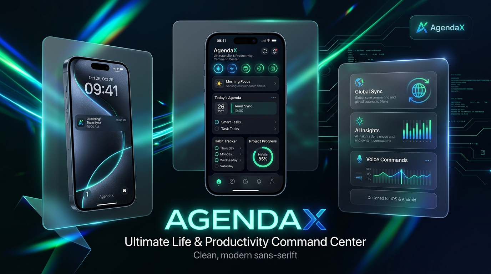
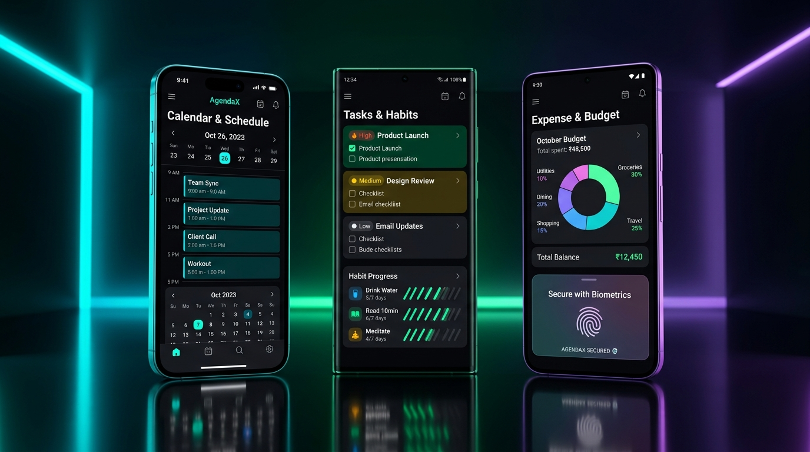
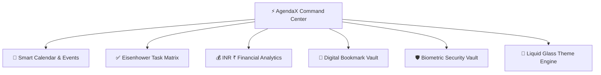

<div align="center">



# ⚡ AgendaX — Ultimate Life & Productivity Command Center

### **Next-Gen iOS 26 Liquid Glass Productivity, Expense & Security Manager**

[](https://github.com/AlbertWaikhom/agendaX/raw/main/agendaX-v1.01.apk)
[](https://github.com/AlbertWaikhom/agendaX/releases/latest)
[](https://reactnative.dev/)
[](https://expo.dev/)
[](https://www.typescriptlang.org/)
[](LICENSE)

[📲 Download APK](#-download--install-apk) • [✨ Key Features](#-key-features) • [📸 Visual Showcase](#-visual-showcase) • [🌟 Daily Life Benefits](#-how-agendax-helps-in-your-daily-life) • [📱 User Guide](#-step-by-step-user-guide) • [🛡️ Security Vault](#-military-grade-security--privacy-vault) • [🛠️ Architecture](#-tech-stack--architecture) • [📦 Build APK](#-how-to-build-standalone-offline-apk) • [👨‍💻 Developer](#-developer--contact)

</div>

---

## 📱 Visual Showcase

<div align="center">



*From Left to Right: (1) Smart Calendar Strip & Event Timelines, (2) Eisenhower Task Matrix & Habit Progress, (3) Native Indian Rupee (₹) Expense Analytics & Biometric Vault.*

</div>

---

## 📖 About AgendaX

**AgendaX** is an all-in-one personal management and lifestyle command center crafted to transform how you plan, organize, and execute your day. Built with **iOS 26 Liquid Glass aesthetics**, dynamic lighting refractions, fluid 60fps spring animations, and tactile haptic feedback, AgendaX combines calendar scheduling, prioritized task tracking, expense budget analytics in Indian Rupees (**₹**), digital bookmark vaults, and military-grade biometric privacy into a single, cohesive experience.

Designed from the ground up as a **100% offline-first application**, AgendaX keeps all your schedules, financial figures, and personal tasks entirely local on your device—zero telemetry, zero tracking, and zero dependence on cloud servers.

---

## 📥 Download & Install APK

Get the standalone **AgendaX Android Release APK** and install it on your Android phone **100% offline (no PC or Metro dev server required)**:

<div align="center">

### 🚀 [📲 Click Here to Download AgendaX v1.01 APK (Direct)](https://github.com/AlbertWaikhom/agendaX/raw/main/agendaX-v1.01.apk)
*(Standalone Signed Release: `agendaX-v1.01.apk` ~ 83 MB)*

**Alternative Mirror**: [Download agendaX-v1.apk](https://github.com/AlbertWaikhom/agendaX/raw/main/agendaX-v1.apk) | [GitHub Releases Hub](https://github.com/AlbertWaikhom/agendaX/releases)

</div>

### 🛠️ Quick Installation Steps:
1. **Download**: Tap the download button above on your Android smartphone.
2. **Install**: Tap `agendaX-v1.01.apk` in your phone's notification bar or Downloads folder.
3. **Allow Unknown Sources**: If prompted with *"Install unknown apps"*, tap **Settings** ➔ toggle **Allow from this source**.
4. **Launch**: Open **AgendaX** and enjoy the next-gen Liquid Glass productivity experience!

> **System Compatibility**: Android 8.0 (Oreo) to Android 15+ (API Level 24 through 36).

---

## ✨ Key Features



### 1. 📅 Events & Schedule Manager
- **Dynamic Calendar Strip**: Instant day-by-day navigation with active event count dots and timeline indicators.
- **Precision Time Blocking**: Schedule meetings, calls, routines, and reminders with custom start & end time pickers.
- **Category Color Coding**: Assign customized vibrant neon palettes to separate Work, Meetings, Personal, Fitness, and Travel.
- **Recurring Schedules**: Set routines to repeat daily, weekly, monthly, or on custom intervals.

### 2. ⚡ Priorities & Task Management
- **Eisenhower Priority Matrix**: Categorize tasks into **High**, **Medium**, or **Low** priority tiers with distinct visual badges.
- **Habit & Milestone Checklists**: Satisfying micro-interactions and haptic pulses as you mark items complete.
- **Smart Due Date Alerts**: Never miss critical deadlines with native scheduled Android notifications.
- **Categorization & Filters**: Instant search and filtering across Work, Personal, Study, Finance, and Custom tags.

### 3. 💰 Monthly Expenses & Financial Analytics (₹ INR)
- **Indian Rupee (₹) Native**: Tailored specifically for Indian financial tracking and currency formats.
- **Interactive Spend Charts**: Visual category breakdowns across Food & Dining, Utilities, Shopping, Travel, Health, and Entertainment.
- **Multi-Channel Payment Tracking**: Log payments made via **UPI**, **Credit/Debit Card**, **Cash**, **Net Banking**, or **Digital Wallets**.
- **Monthly Budget Targets**: Compare actual spending against budget caps with real-time balance metrics.

### 4. 🔗 Digital Bookmark & URL Vault
- **One-Tap Quick Launch**: Fast access to mission-critical portals, cloud dashboards, GitHub repos, and documentation.
- **Context & Credential Notes**: Securely store login usernames or contextual instructions alongside each saved link.
- **Category Grouping**: Keep links tidy across *Portals*, *Work*, *Development*, *Personal*, and *Finance*.

### 5. 🛡️ Military-Grade Security & Privacy Vault
- **Multi-Tier Authentication Modes**:
  - **Biometrics**: Native Fingerprint Scanner & Face Unlock.
  - **Custom 4-6 Digit Master PIN**: Independent PIN protection with cryptographic hashing.
  - **Hybrid Mode**: Biometrics primary with instant PIN fallback.
- **Page-Wise Protection**: Choose to lock the whole app or protect sensitive sub-modules (e.g. *Expenses*, *Secure URLs*, *Tasks*).
- **Anti-Tamper Liquid Glass Keypad**: Translucent keypad with specular highlights, light refraction, error shake physics, and haptic impact.

### 6. 🎨 iOS 26 Liquid Glass Design System
- **Translucent Glassmorphism**: Specular highlight borders, multi-layered depth, and glowing refraction orbs.
- **4 Curated Liquid Effect Themes**:
  - 🌌 **Cyber Dark**: Deep OLED Black with Neon Indigo accents.
  - 🔷 **Midnight Blue**: Executive Navy with Sapphire glow.
  - 👑 **Amber Gold**: Warm Cyberpunk luxury with Golden Amber highlights.
  - ⚡ **Cyberpunk Neon**: High-contrast Electric Violet and Cyan lasers.
- **Apple SF Pro & Jakarta Typography**: High-legibility modern typographic hierarchy.

---

## 🌟 How AgendaX Helps in Your Daily Life

| Everyday Challenge | How AgendaX Solves It |
| :--- | :--- |
| **Scattered schedules across multiple apps** | Consolidates calendar events, daily routines, and timed deadlines in one central screen. |
| **Financial blind spots at month-end** | Tracks daily UPI and card expenditures in ₹ with instant category donut charts. |
| **Lost portals, meeting rooms & bookmarks** | Built-in link vault with quick-launch buttons, tags, and credential notes. |
| **Privacy concerns on shared devices** | Locks sensitive financial and task data behind biometric fingerprint, Face ID, or PIN. |
| **Cluttered, distracting productivity apps** | Inspiring iOS 26 Liquid Glass interface with haptic feedback that makes planning a pleasure. |
| **Unreliable internet connections** | 100% offline functionality with persistent local storage—always accessible. |

---

## 📱 Step-by-Step User Guide

### 🚀 1. Getting Started
1. Launch **AgendaX** on your phone.
2. Complete the initial welcome walkthrough or proceed directly to the **Dashboard**.
3. Customize your visual experience by opening **Settings ➔ Liquid Effect Theme** and selecting your favorite colorway.

### 📅 2. Creating Events
1. Tap the **`+` (Floating Action Button)** or navigate to the **Events** tab.
2. Enter the **Event Name**, **Date**, **Start/End Time**, and pick a **Theme Color**.
3. Toggle **Set Reminder** if you want an advance notification alert.
4. Tap **Create Event**.

### ✅ 3. Managing Tasks
1. Switch to the **Tasks** tab.
2. Tap **`+ Add Task`**.
3. Enter your task title, set the priority (**High / Medium / Low**), and assign a category.
4. Check off tasks as you finish them to trigger rewarding haptic pulses!

### 💵 4. Logging Expenses
1. Switch to the **Expenses** tab (authenticate with your PIN/Biometrics if locked).
2. Tap **`+ Add Expense`**.
3. Enter the amount in **₹ (INR)**, pick the category (e.g., *Food & Dining*, *Utilities*), and payment method (*UPI*, *Card*, *Cash*).
4. Review your **Total Spent** card and visual monthly breakdown chart.

### 🔒 5. Securing with Vault Lock
1. Navigate to **More ➔ Security & Privacy Vault**.
2. Toggle **App Lock** or configure **Page-Specific Locks** (e.g. lock only *Expenses* and *URLs*).
3. Select your preferred lock method: **Biometrics** or **Custom PIN**.
4. Set your custom 4-6 digit passcode.

---

## 🛠️ Tech Stack & Architecture

```text
┌────────────────────────────────────────────────────────┐
│                   AgendaX Client App                   │
├────────────────────────────────────────────────────────┤
│  UI Layer: React Native 0.86 + Expo SDK 57 (TypeScript)│
│  Design: iOS 26 Liquid Glass Translucent StyleSheets   │
│  Navigation: React Navigation Native Stack & Tab Bar   │
├────────────────────────────────────────────────────────┤
│                  Core Service Engines                  │
├──────────────────┬──────────────────┬──────────────────┤
│ Event & Task Svc │  Expense Svc (₹) │ Security & Vault │
├──────────────────┴──────────────────┴──────────────────┤
│                  Device Hardware APIs                  │
├──────────────────┬──────────────────┬──────────────────┤
│ expo-local-auth  │   expo-haptics   │ expo-notifs / db │
├──────────────────┴──────────────────┴──────────────────┤
│              Offline Persistence Storage               │
└────────────────────────────────────────────────────────┘
```

- **Framework**: [React Native 0.86](https://reactnative.dev/) with [Expo SDK 57](https://expo.dev/)
- **Language**: TypeScript 6.0 (Strict mode)
- **Navigation**: React Navigation (Native Stack + Custom Liquid Tab Bar)
- **Local Database**: React Native Async Storage & SQLite (Offline-First)
- **Biometrics & Security**: `expo-local-authentication`
- **Haptic Engine**: `expo-haptics`
- **Iconography**: Expo Vector Icons (Ionicons, Feather)
- **Styling Architecture**: Modular theme tokens with dynamic lighting shaders

---

## 📦 How to Build Standalone Offline APK

You can build a standalone **Release APK** that runs 100% offline on any Android phone without needing a computer or Metro server:

### 1-Click Build (Windows)
Double-click `build-apk.bat` in the project root, or run in PowerShell:
```powershell
.\build-apk.bat
```

### Manual Build Command
```powershell
# Set Java Home & Android SDK
$env:JAVA_HOME = "D:\software\Android-Studio\jbr"
$env:PATH = "$env:JAVA_HOME\bin;$env:PATH"

# Bundle JS/TS assets
npx expo export:embed --entry-file index.ts --platform android --dev false --bundle-output android/app/src/main/assets/index.android.bundle --assets-dest android/app/src/main/res

# Compile Standalone Release APK
cd android
.\gradlew.bat app:assembleRelease
```

📂 **Generated APK Output Path:**
```text
android\app\build\outputs\apk\release\app-release.apk
```

---

## 👨‍💻 Developer & Contact

Developed with ❤️ by **Waikhom Albert Mangang**

- 🐙 **GitHub**: [@AlbertWaikhom](https://github.com/AlbertWaikhom/)
- 💼 **LinkedIn**: [Waikhom Albert Mangang](https://www.linkedin.com/in/waikhom-albert-mangang-9b4362246/)
- 📸 **Instagram**: [@albert_waikhom](https://www.instagram.com/albert_waikhom/)
- 🌐 **Portfolio / Works**: [Creative Vasishtha](https://creativevasishtha.com/)

---

<div align="center">
  <sub>Released under the MIT License • Built with passion for high-performance mobile software</sub>
</div>
