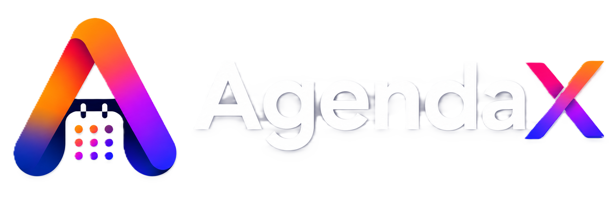

# 🌌 AgendaX — Ultimate Life & Productivity Command Center

<div align="center">



### **Next-Gen iOS 26 Liquid Glass Productivity, Expense & Security Manager**

[](https://github.com/AlbertWaikhom/agendaX/releases/latest)
[](https://github.com/AlbertWaikhom/agendaX/releases/latest)
[](https://reactnative.dev/)
[](https://expo.dev/)
[](https://www.typescriptlang.org/)
[](LICENSE)

[⬇️ Download APK](#-download--install-apk) • [Features](#-key-features) • [Daily Life Benefits](#-how-agendax-helps-in-your-daily-life) • [Step-by-Step Guide](#-step-by-step-user-guide) • [Security Vault](#-security--privacy-vault) • [Building APK](#-how-to-build-offline-apk) • [Developer](#-developer--contact)

</div>

---

## 📥 Download & Install APK

Get the standalone **AgendaX Android APK** and run the app directly on your phone **100% offline (no PC or server needed)**:

<div align="center">

### 📲 [👉 Click Here to Download agendaX v-1 APK](https://github.com/AlbertWaikhom/agendaX/releases/download/v1.0.0/agendaX-v1.apk)
*(Direct file download: `agendaX-v1.apk` ~ 82 MB)*

Or view all releases: **[GitHub Releases Hub](https://github.com/AlbertWaikhom/agendaX/releases)**

</div>

### 🛠️ Easy Installation Steps:
1. **Download**: Tap the download button above on your Android phone.
2. **Install**: Tap `app-release.apk` in your phone's notification or Downloads folder.
3. **Allow Permission**: If prompted with *"Install unknown apps"*, tap **Settings** → toggle **Allow from this source**.
4. **Launch**: Open **AgendaX** and enjoy the next-gen iOS 26 Liquid Glass experience!

> **System Compatibility**: Android 8.0 (Oreo) to Android 15+ (API 24 to 36).

---

## 📖 About AgendaX

**AgendaX** is an all-in-one personal management and lifestyle optimization application designed to streamline your daily workflow. Built with **iOS 26 Liquid Glass aesthetics**, dynamic lighting refraction, smooth spring micro-animations, and haptic feedback, AgendaX combines calendar scheduling, prioritized task tracking, expense budget analytics in Indian Rupees (**₹**), bookmark/link organization, and military-grade biometric privacy into a single fluid experience.

Whether you are managing tight work deadlines, planning daily routines, monitoring monthly financial habits, or securing sensitive personal data, AgendaX acts as your reliable offline digital assistant.

---

## ✨ Key Features

### 1. 📅 Events & Schedule Manager
- **Calendar Strip Navigation**: Quick-hop between days with real-time event status indicators.
- **Detailed Time Blocks**: Schedule meetings, calls, and routines with start & end time selectors.
- **Category Color Coding**: Assign customized vibrant colors to separate work, meetings, fitness, and family events.
- **Recurring Schedules**: Daily, weekly, monthly, or custom repeat routines.

### 2. ⚡ Priorities & Task Management
- **Eisenhower Priority Matrix**: Classify tasks by *High*, *Medium*, or *Low* priority with visual tags.
- **Customizable Categories**: Organize tasks across Work, Personal, Study, Finance, and custom labels.
- **Due Date & Time Reminders**: Never miss critical milestones with timely notifications.
- **Haptic Completion Checklists**: Satisfying micro-interactions when clearing tasks.

### 3. 💰 Monthly Expenses & Financial Analytics (₹ INR)
- **Indian Rupee (₹) Native**: Tailored specifically for Indian currency transactions.
- **Category Spend Breakdown**: Track expenses across Food, Housing, Transportation, Utilities, Shopping, Entertainment, Health, and more.
- **Payment Method Tracking**: Log transactions made via UPI, Card, Cash, Bank Transfer, or Digital Wallets.
- **Monthly Interactive Analytics**: Visual spend comparison charts with highest-spend category insights.

### 4. 🔗 Important URLs & Digital Bookmark Vault
- **One-Tap Quick Launch**: Access mission-critical portals, cloud dashboards, GitHub repos, and documents.
- **Search & Categorization**: Instant filter by category tags (*Portals*, *Work*, *Development*, *Personal*).
- **Credentials & Context Notes**: Securely store login usernames or contextual instructions with each URL.

### 5. 🛡️ Military-Grade Security & Page-Wise Lock
- **Multi-Mode App Security**:
  - **Biometrics / Face ID / Fingerprint**
  - **Custom 4-6 Digit Master PIN** (with default `1234` fallback)
  - **Hybrid Authentication** (Biometrics + PIN Fallback)
- **Page-Level Protection**: Lock the whole app or protect specific sensitive tabs (e.g. *Expenses*, *Secure URLs*, *Tasks*).
- **Anti-Tamper PIN Keypad**: Transparent iOS 26 Liquid Glass keypad with ambient light refraction, error shake animation, and haptic impact.

### 6. 🎨 iOS 26 Liquid Glass Design System
- **Translucent Glassmorphism**: Specular highlight rims, multi-layered depth, and glowing refraction orbs.
- **4 Premium Curated Themes**:
  - 🌌 **Cyber Dark** (Deep OLED Black with Neon Indigo accents)
  - 🔷 **Midnight Blue** (Executive Navy & Sapphire Glow)
  - 👑 **Amber Gold** (Warm Cyberpunk Luxury)
  - ⚡ **Cyberpunk Neon** (Vibrant Electric Violet)
- **Apple SF Pro Typography**: Modern, crisp, readable typography hierarchy.

---

## 🌟 How AgendaX Helps in Your Daily Life

| Life Challenge | How AgendaX Solves It |
| :--- | :--- |
| **Scattered schedules across apps** | Centralizes calendar events, daily routines, and timed deadlines in one dashboard. |
| **Financial blind spots at month-end** | Tracks daily UPI and card expenses in ₹ with instant category breakdown charts. |
| **Losing important bookmarks & links** | One-tap vault for repository links, portals, and meeting rooms with notes. |
| **Privacy on shared phones** | Locks sensitive financial and task data behind fingerprint, Face ID, or PIN. |
| **Cluttered, ugly productivity apps** | Inspiring iOS 26 Liquid Glass aesthetics with haptic feedback that makes daily planning enjoyable. |
| **No internet connectivity** | 100% offline functionality with local AsyncStorage persistence. |

---

## 📱 Step-by-Step User Guide

### 🚀 Getting Started
1. Launch **AgendaX** on your phone.
2. Complete the initial welcome setup or jump straight into the **Dashboard**.
3. Choose your favorite visual theme in **Settings** (Cyber Dark, Midnight, Amber Gold, or Light).

### 📅 Managing Events
1. Tap the **`+` (Floating Action Button)** or navigate to the **Events** tab.
2. Enter the **Event Name**, **Date**, **Start/End Time**, and pick a **Theme Color**.
3. Toggle **Set Reminder** if you want an advance notification.
4. Tap **Create Event**.

### ✅ Tracking Daily Tasks
1. Go to the **Tasks** tab.
2. Tap **`+ Add Task`**.
3. Enter title, select priority level (**High / Medium / Low**), and set category.
4. Check off tasks as you complete them to hear and feel the haptic feedback!

### 💵 Recording Expenses
1. Go to the **Expenses** tab (unlock with PIN/Biometrics if locked).
2. Tap **`+ Add Expense`**.
3. Enter amount in **₹ (INR)**, choose the spending category (e.g., *Food & Dining*, *Utilities*), and payment method (*UPI*, *Card*, *Cash*).
4. Review your **Total Spent** and visual spending breakdown chart for the month.

### 🔒 Setting Up Security & App Lock
1. Go to **More → Security & Privacy**.
2. Enable **App Lock** or **Page-Specific Locks** (Expenses, URLs, etc.).
3. Choose authentication method: **Biometrics (Fingerprint/Face ID)** or **Custom PIN**.
4. Set your unique 4-6 digit passcode.

---

## 🛠️ Tech Stack & Architecture

- **Framework**: [React Native 0.86](https://reactnative.dev/) with [Expo SDK 57](https://expo.dev/)
- **Language**: TypeScript 6.0
- **Navigation**: React Navigation (Native Stack + Liquid Tab Bar)
- **Local Database**: React Native Async Storage (Offline First)
- **Biometrics**: `expo-local-authentication`
- **Sensors & Haptics**: `expo-haptics`
- **Icons & Graphics**: Expo Vector Icons (Ionicons)
- **Styling**: Modular StyleSheets with Dynamic Liquid Glass Theme Tokens

---

## 📦 How to Build Standalone Offline APK

You can build a standalone **Release APK** that runs 100% offline on any Android phone without needing a computer or Metro server:

### 1-Click Build (Windows)
Double-click `build-apk.bat` in the project root, or run in PowerShell:
```powershell
.\build-apk.bat
```

### Manual Command
```powershell
$env:JAVA_HOME = "D:\software\Android-Studio\jbr"
$env:PATH = "$env:JAVA_HOME\bin;$env:PATH"
npx expo export:embed --entry-file index.ts --platform android --dev false --bundle-output android/app/src/main/assets/index.android.bundle --assets-dest android/app/src/main/res
cd android
.\gradlew.bat app:assembleRelease
```

📂 **Generated APK Output:**
```text
android\app\build\outputs\apk\release\app-release.apk
```

---

## 👨‍💻 Developer & Contact

Developed with ❤️ by **Waikhom Albert Mangang**

- 🐙 **GitHub**: [@AlbertWaikhom](https://github.com/AlbertWaikhom/)
- 💼 **LinkedIn**: [Waikhom Albert Mangang](https://www.linkedin.com/in/waikhom-albert-mangang-9b4362246/)
- 📸 **Instagram**: [@albert_waikhom](https://www.instagram.com/albert_waikhom/)

---

## 📄 License

This project is licensed under the MIT License — see the [LICENSE](LICENSE) file for details.
